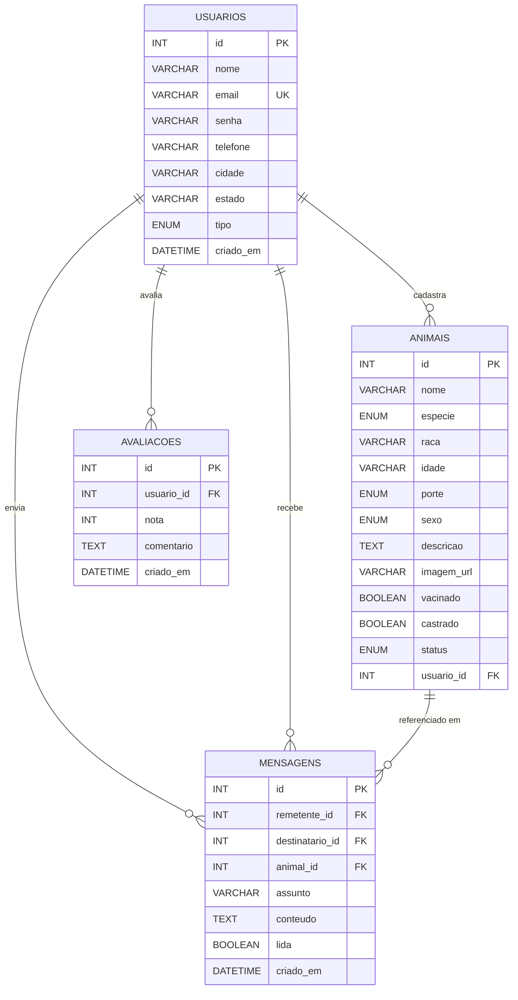

<p align="center">
  
</p>

<h1 align="center">🐾 SalvaPet</h1>
<p align="center"><strong>Adoção e Doação de Animais</strong></p>
<p align="center">
  Plataforma web para conectar pessoas que desejam adotar animais<br>
  com quem precisa encontrar um lar cheio de amor para seus pets.
</p>

<p align="center">
  
  
  
  
  
</p>

<p align="center">
  
  
  
</p>

---

## 📋 Índice

- [Sobre o Projeto](#-sobre-o-projeto)
- [Funcionalidades](#-funcionalidades)
- [Detalhes de Implementação](#-detalhes-de-implementação)
- [Tecnologias Utilizadas](#-tecnologias-utilizadas)
- [Dependências](#-dependências)
- [Estrutura de Arquivos](#-estrutura-de-arquivos)
- [Pré-requisitos](#-pré-requisitos)
- [Como Executar](#-como-executar)
- [Endpoints da API](#-endpoints-da-api)
- [Banco de Dados](#-banco-de-dados)
- [Equipe](#-equipe)
- [Licença](#-licença)

---

## 🐕 Sobre o Projeto

**SalvaPet** é uma plataforma web fullstack desenvolvida como Trabalho de Conclusão de Curso (TCC) da **ETEC de Presidente Venceslau — 3º DS (Desenvolvimento de Sistemas)**, com o objetivo de facilitar o processo de adoção e doação de animais.

A plataforma conecta **doadores** (pessoas que precisam encontrar um novo lar para seus animais) com **adotantes** (pessoas que desejam adotar), oferecendo um catálogo completo com filtros de busca, sistema de cadastro de animais e sistema de avaliação da plataforma.

### O que a plataforma oferece:

- 🏠 **Página inicial** com animais em destaque, estatísticas e avaliações de usuários
- 🐶 **Catálogo de animais** com filtros por espécie, porte, sexo e cidade
- 📝 **Cadastro de animais** para doação com informações detalhadas
- 👤 **Sistema de autenticação** com login e registro de usuários
- ⭐ **Avaliações** — sistema de rating com notas de 1 a 5 estrelas
- 📞 **Página de contato** para comunicação entre usuários
- ℹ️ **Sobre nós** — história e missão da plataforma

---

## ✨ Funcionalidades

| Funcionalidade | Descrição |
|---|---|
| **Catálogo de animais** | Listagem com cards interativos mostrando foto, nome, raça, idade, porte e status de vacinação/castração |
| **Filtros avançados** | Busca por espécie (cachorro/gato/outro), porte (pequeno/médio/grande), sexo, cidade e texto livre |
| **Cadastro de pets** | Formulário completo para doação com upload de imagem, dados de saúde e localização |
| **Autenticação** | Sistema de login/cadastro com validação de e-mail único e perfis (adotante/doador/ambos) |
| **Avaliações** | Sistema de rating 1-5 estrelas com comentários e média geral exibida na home |
| **Estatísticas em tempo real** | Contadores de animais disponíveis, adotados e usuários cadastrados via API |
| **Mensageria** | Sistema de mensagens entre usuários associadas a animais específicos |
| **Design responsivo** | Layout adaptativo para desktop, tablet e mobile |
| **SPA com roteamento** | Navegação client-side com React Router DOM (sem recarregar a página) |
| **API RESTful** | Backend completo com CRUD de animais, usuários, avaliações e mensagens |

---

## 🔧 Detalhes de Implementação

### Arquitetura do Projeto

O projeto segue uma arquitetura **fullstack** com separação entre front-end (React SPA) e back-end (Express API REST):

```
┌─────────────────────────────────────────────────────┐
│                    FRONT-END                        │
│  React 19 + TypeScript + Vite + React Router DOM    │
│  SPA com roteamento client-side                     │
└──────────────────────┬──────────────────────────────┘
                       │ HTTP (fetch API)
                       ▼
┌─────────────────────────────────────────────────────┐
│                    BACK-END                         │
│  Express 5 + TypeScript (tsx)                       │
│  API RESTful com CORS habilitado                    │
└──────────────────────┬──────────────────────────────┘
                       │ mysql2/promise (pool)
                       ▼
┌─────────────────────────────────────────────────────┐
│                  BANCO DE DADOS                     │
│  MySQL 8.x (InnoDB, utf8mb4)                        │
│  4 tabelas com Foreign Keys                         │
└─────────────────────────────────────────────────────┘
```

### Front-End — React SPA

#### Roteamento (React Router DOM v7)

| Rota | Componente | Descrição |
|---|---|---|
| `/` | `Home` | Página inicial com destaques, estatísticas e avaliações |
| `/animais` | `Animais` | Catálogo com filtros e listagem de animais |
| `/doar` | `Doar` | Formulário de cadastro de animal para doação |
| `/sobre` | `Sobre` | Informações sobre a plataforma e a equipe |
| `/contato` | `Contato` | Formulário de contato |
| `/login` | `Login` | Autenticação de usuários |
| `/cadastro` | `Login` | Registro de novos usuários (mesmo componente do login) |
| `/avaliar` | `Avaliar` | Sistema de avaliação do site |

#### Layout de componentes

O `App.tsx` utiliza o padrão de **layout wrapper** com `<Outlet />` do React Router:

```
<App>
  ├── <Header />      →  Navegação global (sempre visível)
  ├── <main>
  │   └── <Outlet />  →  Conteúdo dinâmico por rota
  └── <Footer />      →  Rodapé global (sempre visível)
</App>
```

#### Design System (CSS Custom Properties)

O sistema visual é controlado por variáveis CSS com a paleta temática amarelo/marrom:

| Categoria | Variáveis | Descrição |
|---|---|---|
| **Cores primárias** | `--amarelo` (#fad817), `--marrom` (#7d4f05) | Paleta principal inspirada em tons quentes |
| **Backgrounds** | `--bg-principal` (#fffdf0), `--bg-card`, `--bg-footer` | Fundos claros com contraste no footer |
| **Texto** | `--texto-primario` (#2d1b00), `--texto-secundario` | Tons marrons para alta legibilidade |
| **Status** | `--sucesso`, `--erro`, `--alerta`, `--info` | Cores semânticas para feedback |
| **Sombras** | `--sombra-suave` a `--sombra-card-hover` | Sombras com tonalidade dourada no hover |
| **Tipografia** | `--fonte-principal` (Poppins) | Fonte do Google Fonts, pesos 300-800 |
| **Espaçamento** | `--radius-sm` a `--radius-xl` | 8px a 28px de border-radius |
| **Transições** | `--transicao`, `--transicao-rapida` | Curvas `cubic-bezier(0.4, 0, 0.2, 1)` |

#### Animações CSS

| Animação | Uso |
|---|---|
| `fadeInUp` | Entrada de elementos com deslocamento vertical |
| `fadeIn` | Transição suave de opacidade |
| `pulsar` | Efeito de destaque em elementos interativos |
| `float` | Flutuação suave de elementos decorativos |
| `slideInLeft` | Entrada lateral esquerda |
| `slideInRight` | Entrada lateral direita |

### Back-End — API Express

#### Configuração do servidor

- **Framework:** Express 5.2 com TypeScript
- **Porta padrão:** 3000 (configurável via `.env`)
- **CORS:** Habilitado para permitir requisições do front-end
- **Parser:** `express.json()` para body parsing automático
- **Hot reload:** Executado via `npx tsx watch` para desenvolvimento

#### Conexão com banco de dados

O módulo `database.ts` configura um **connection pool** do `mysql2/promise`:

```typescript
export const pool = mysql.createPool({
    host: process.env.DB_HOST || 'localhost',
    user: process.env.DB_USER || 'root',
    password: process.env.DB_PASSWORD || '',
    database: process.env.DB_NAME || 'salvapet',
    waitForConnections: true,
    connectionLimit: 10,  // Máximo 10 conexões simultâneas
    queueLimit: 0         // Fila ilimitada
});
```

#### Variáveis de ambiente (`.env`)

```env
PORT=3000
DB_HOST=localhost
DB_USER=root
DB_PASSWORD=
DB_NAME=salvapet
```

---

## 🛠 Tecnologias Utilizadas

### Front-End

| Tecnologia | Versão | Uso |
|---|---|---|
| **React** | 19.2.8 | Biblioteca para construção da interface (componentes funcionais + hooks) |
| **TypeScript** | ~6.0.2 | Tipagem estática para JavaScript |
| **Vite** | 8.3.0 | Bundler e dev server com HMR (Hot Module Replacement) |
| **React Router DOM** | 7.18.4 | Roteamento client-side (SPA) com `createBrowserRouter` |
| **CSS3** | — | Estilização modular por componente com Custom Properties |
| **Google Fonts** | CDN | Tipografia Poppins (pesos 300-800) |

### Back-End

| Tecnologia | Versão | Uso |
|---|---|---|
| **Express** | 5.2.1 | Framework HTTP para a API REST |
| **mysql2** | 3.24.4 | Driver MySQL com suporte a Promises e connection pool |
| **CORS** | 2.8.6 | Middleware para Cross-Origin Resource Sharing |
| **dotenv** | 18.0.4 | Carregamento de variáveis de ambiente via `.env` |
| **tsx** | — | Execução de TypeScript diretamente no Node.js (watch mode) |

### Ferramentas de Desenvolvimento

| Ferramenta | Versão | Uso |
|---|---|---|
| **ESLint** | 10.10.0 | Linter para qualidade de código |
| **eslint-plugin-react-hooks** | 7.1.1 | Regras de linting para hooks do React |
| **eslint-plugin-react-refresh** | 0.5.6 | Regras para React Fast Refresh |
| **typescript-eslint** | 8.69.0 | Integração do TypeScript com ESLint |
| **@vitejs/plugin-react** | 6.1.1 | Plugin Vite para React (Oxc) |

---

## 📦 Dependências

### Dependências de produção (`dependencies`)

| Pacote | Versão | Tipo | Descrição |
|---|---|---|---|
| `react` | ^19.2.8 | Front-End | Biblioteca de componentes UI |
| `react-dom` | ^19.2.8 | Front-End | Renderização do React no DOM |
| `react-router-dom` | ^7.18.4 | Front-End | Roteamento SPA |
| `express` | ^5.2.1 | Back-End | Framework web HTTP |
| `mysql2` | ^3.24.4 | Back-End | Driver MySQL com promises |
| `cors` | ^2.8.6 | Back-End | Middleware CORS |
| `dotenv` | ^18.0.4 | Back-End | Variáveis de ambiente |

### Dependências de desenvolvimento (`devDependencies`)

| Pacote | Versão | Descrição |
|---|---|---|
| `typescript` | ~6.0.2 | Compilador TypeScript |
| `vite` | ^8.3.0 | Bundler e dev server |
| `@vitejs/plugin-react` | ^6.1.1 | Plugin React para Vite |
| `eslint` | ^10.10.0 | Linter de código |
| `eslint-plugin-react-hooks` | ^7.1.1 | Regras para React Hooks |
| `eslint-plugin-react-refresh` | ^0.5.6 | Regras para Fast Refresh |
| `typescript-eslint` | ^8.69.0 | ESLint + TypeScript |
| `globals` | ^17.12.0 | Definições de globais para ESLint |
| `ts-node-dev` | ^2.0.0 | Hot reload para TypeScript |
| `@types/react` | ^19.2.18 | Tipagens do React |
| `@types/react-dom` | ^19.2.7 | Tipagens do React DOM |
| `@types/express` | ^5.0.6 | Tipagens do Express |
| `@types/cors` | ^2.8.19 | Tipagens do CORS |
| `@types/node` | ^24.13.6 | Tipagens do Node.js |
| `@eslint/js` | ^10.0.1 | Config base do ESLint |

### Dependências externas (infraestrutura)

| Dependência | Versão | Obrigatória | Descrição |
|---|---|---|---|
| **Node.js** | 18+ | ✅ | Runtime JavaScript para front e back |
| **npm** | 9+ | ✅ | Gerenciador de pacotes |
| **MySQL Server** | 8.x | ✅ | Banco de dados relacional |
| **Google Fonts (Poppins)** | CDN | ✅ | Tipografia (carregada via CSS) |

---

## 📁 Estrutura de Arquivos

```
Salva-Pet/
├── 📁 database/
│   └── 📄 schema.sql               # Script de criação do banco (4 tabelas + dados exemplo)
├── 📁 public/
│   ├── 🖼️ favicon.svg              # Ícone do navegador (SVG)
│   ├── 🖼️ icons.svg                # Ícones SVG do projeto
│   └── 🖼️ log.png                  # Logo do SalvaPet
├── 📁 src/
│   ├── 📁 Back Ends/
│   │   ├── ⚙️ .env                 # Variáveis de ambiente (DB_HOST, DB_USER, etc.)
│   │   ├── 📄 database.ts          # Configuração do pool MySQL (mysql2/promise)
│   │   └── 📄 serve.ts             # Servidor Express — API REST (~290 linhas)
│   ├── 📁 Componetes/
│   │   └── 📁 pages/
│   │       ├── 📁 Header/
│   │       │   ├── 📄 header.tsx    # Componente de navegação global
│   │       │   └── 🎨 header.css   # Estilos do header
│   │       ├── 📁 Footer/
│   │       │   ├── 📄 footer.tsx   # Componente de rodapé
│   │       │   └── 🎨 footer.css   # Estilos do footer
│   │       ├── 📄 Home.tsx          # Página inicial (destaques + stats + reviews)
│   │       ├── 🎨 Home.css          # Estilos da home
│   │       ├── 📄 Animais.tsx       # Catálogo com filtros
│   │       ├── 🎨 Animais.css       # Estilos do catálogo
│   │       ├── 📄 Doar.tsx          # Formulário de doação
│   │       ├── 🎨 Doar.css          # Estilos da doação
│   │       ├── 📄 Login.tsx         # Login + Cadastro
│   │       ├── 🎨 Login.css         # Estilos do login
│   │       ├── 📄 Sobre.tsx         # Sobre a plataforma
│   │       ├── 🎨 Sobre.css         # Estilos do sobre
│   │       ├── 📄 Contato.tsx       # Página de contato
│   │       ├── 🎨 Contato.css       # Estilos do contato
│   │       ├── 📄 Avaliar.tsx       # Sistema de avaliação
│   │       ├── 🎨 Avaliar.css       # Estilos da avaliação
│   │       └── 🎨 pages.css         # Estilos compartilhados entre páginas
│   ├── 📁 assets/                   # Assets estáticos do Vite
│   ├── 📄 App.tsx                   # Layout principal (Header + Outlet + Footer)
│   ├── 🎨 App.css                   # Estilos do App
│   ├── 📄 main.tsx                  # Entry point — configuração do Router
│   └── 🎨 index.css                 # Design System global (variáveis + reset + utilitários)
├── 📄 index.html                    # HTML entry point (Vite)
├── 📄 package.json                  # Dependências e scripts npm
├── 📄 vite.config.ts                # Configuração do Vite
├── 📄 tsconfig.json                 # Configuração base TypeScript
├── 📄 tsconfig.app.json             # Config TS para o app
├── 📄 tsconfig.node.json            # Config TS para scripts Node
├── 📄 eslint.config.js              # Configuração do ESLint
├── 📄 .gitignore                    # Arquivos ignorados pelo Git
└── 📖 README.md                     # Este arquivo
```

---

## ✅ Pré-requisitos

### Obrigatório

| Requisito | Versão mínima | Descrição |
|---|---|---|
| **Node.js** | 18+ | Runtime JavaScript (recomendado: LTS mais recente) |
| **npm** | 9+ | Gerenciador de pacotes (vem com o Node.js) |
| **MySQL Server** | 8.x | Banco de dados relacional |

### Opcional (recomendado)

| Ferramenta | Uso |
|---|---|
| **VS Code** | Editor de código recomendado |
| **MySQL Workbench** | Interface gráfica para gerenciar o banco |
| **XAMPP / Laragon** | Ambiente com MySQL incluso para facilitar a instalação |
| **Insomnia / Postman** | Testar endpoints da API REST |

---

## 🚀 Como Executar

### 1. Clonar o repositório

```bash
git clone https://github.com/RalffXP/SalvaPet.git
cd SalvaPet/Salva-Pet
```

### 2. Instalar dependências

```bash
npm install
```

### 3. Configurar o banco de dados

1. Certifique-se de que o **MySQL** está rodando
2. Execute o script de criação do banco:

```bash
mysql -u root -p < database/schema.sql
```

Ou copie o conteúdo de `database/schema.sql` e execute no **MySQL Workbench** ou terminal MySQL.

3. (Opcional) Ajuste as credenciais no arquivo `src/Back Ends/.env`:

```env
PORT=3000
DB_HOST=localhost
DB_USER=root
DB_PASSWORD=sua_senha_aqui
DB_NAME=salvapet
```

### 4. Iniciar o servidor back-end (API)

```bash
npm run server
```

> O servidor irá rodar em `http://localhost:3000` com hot reload ativado.

### 5. Iniciar o front-end (React + Vite)

Em outro terminal:

```bash
npm run dev
```

> O Vite dev server irá rodar em `http://localhost:5173` (padrão).

### 6. Acessar a aplicação

Abra o navegador em **`http://localhost:5173`** 🎉

---

## 📡 Endpoints da API

### Animais

| Método | Endpoint | Descrição | Filtros (query params) |
|---|---|---|---|
| `GET` | `/api/animais` | Listar todos os animais | `especie`, `porte`, `sexo`, `cidade`, `status`, `busca` |
| `GET` | `/api/animais/:id` | Buscar animal por ID | — |
| `POST` | `/api/animais` | Cadastrar novo animal | — |
| `PUT` | `/api/animais/:id` | Atualizar animal | — |
| `DELETE` | `/api/animais/:id` | Remover animal | — |

### Usuários

| Método | Endpoint | Descrição |
|---|---|---|
| `POST` | `/api/usuarios` | Cadastrar novo usuário |
| `POST` | `/api/login` | Autenticar usuário |
| `GET` | `/api/usuarios/:id` | Buscar usuário por ID |

### Avaliações

| Método | Endpoint | Descrição |
|---|---|---|
| `GET` | `/api/avaliacoes` | Listar todas as avaliações |
| `POST` | `/api/avaliacoes` | Cadastrar nova avaliação |
| `GET` | `/api/avaliacoes/media` | Obter média e total de avaliações |

### Mensagens

| Método | Endpoint | Descrição |
|---|---|---|
| `POST` | `/api/mensagens` | Enviar mensagem |
| `GET` | `/api/mensagens/:usuario_id` | Listar mensagens do usuário |

### Estatísticas

| Método | Endpoint | Descrição |
|---|---|---|
| `GET` | `/api/estatisticas` | Animais disponíveis, adotados e total de usuários |

---

## 🗄️ Banco de Dados

### Diagrama Entidade-Relacionamento



### Tabelas

| Tabela | Registros (exemplo) | Descrição |
|---|---|---|
| `usuarios` | 3 | Perfis de adotantes/doadores com dados de contato |
| `animais` | 6 | Catálogo de pets com informações de saúde e localização |
| `avaliacoes` | 3 | Avaliações do site com notas e comentários |
| `mensagens` | — | Comunicação entre usuários sobre animais |

### Características do schema

- **Engine:** InnoDB (suporte a transações e foreign keys)
- **Charset:** utf8mb4 + utf8mb4_unicode_ci (suporte completo a emojis/caracteres especiais)
- **Foreign Keys:** com `ON DELETE CASCADE` e `ON DELETE SET NULL`
- **Validações:** `CHECK (nota BETWEEN 1 AND 5)`, `UNIQUE` em email
- **Timestamps automáticos:** `DEFAULT CURRENT_TIMESTAMP` e `ON UPDATE CURRENT_TIMESTAMP`

---

## 📜 Scripts npm

| Script | Comando | Descrição |
|---|---|---|
| `dev` | `npm run dev` | Inicia o Vite dev server (front-end) com HMR |
| `build` | `npm run build` | Compila TypeScript e gera build de produção |
| `preview` | `npm run preview` | Serve o build de produção localmente |
| `server` | `npm run server` | Inicia o servidor Express (back-end) com hot reload |
| `lint` | `npm run lint` | Executa ESLint em todo o projeto |

---

## 👥 Equipe

| Função | Nome |
|---|---|
| **Desenvolvimento** | Ralff |
| **Gerente de Projetos** | Vinícius Lima |
| ** Os burros **| Yasmin Colares,Yasmim Mizael, Ana Andrade, Brayan, Larrisa Gabrielli |

**Instituição:** ETEC de Presidente Venceslau  
**Curso:** 3º Desenvolvimento de Sistemas  
**Disciplina:** Projeto Multidisciplinar (TCC)  
**Ano:** 2026

---

## 📄 Licença

Este projeto foi desenvolvido para fins educacionais como Trabalho de Conclusão de Curso (TCC). Todos os direitos reservados aos autores.

---

<p align="center">
  <strong>🐾 Adote, não compre. Transforme uma vida!</strong>
</p>

<p align="center">
  <sub>Feito com 💛 pela equipe SalvaPet — ETEC Presidente Venceslau, 2026</sub>
</p>
